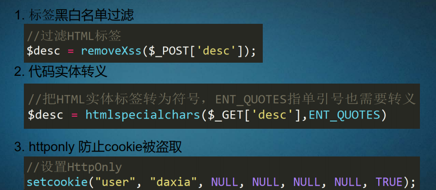
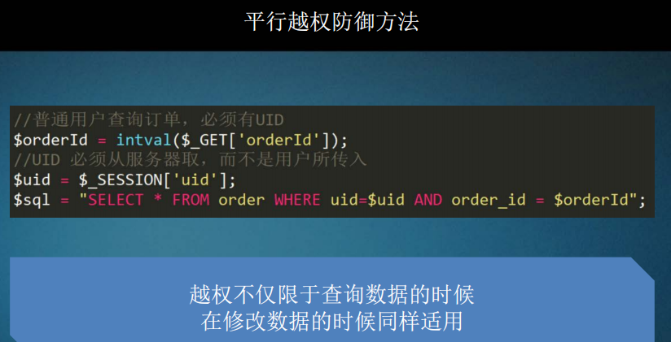
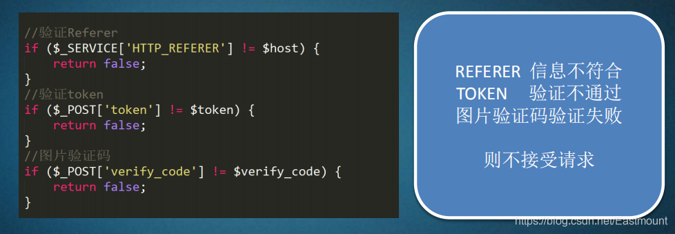

# 五種常見攻擊方式

通過報錯顯示了一些敏感信息，我們稱之爲報錯注入。

盲注

可以根據條件進行數據庫猜測。

檢測頁面當中有沒有注入點，工具：SQLMAP

它的詳細用法請參考

寫檢測表達式，Sqlmap.py以及需要檢測的UI，需要有這個註冊點它會告訴你有哪些注入，比如說這個頁面        是在本地測試的結果，它就告訴了有回顯注入、錯誤注入以及一些盲注。

防範服務器的安全

    1.   攔截帶有SQL的語句傳入

    2.   通過預編譯處理拼接參數的SQL語句。

    3.   定期分析數據庫執行日誌，判斷是否有異常SQL執行。


XSS跨站

跨網站腳本（Cross-site scripting，通常簡稱爲XSS或跨站腳本或跨站腳本攻擊）是一種網站應用程序的安全漏洞攻擊，是代碼注入的一種。它允許惡意用戶將代碼注入到網頁上，其他用戶在觀看網頁時就會受到影響。這類攻擊通常包含了HTML以及用戶端腳本語言。

XSS攻擊通常指的是通過利用網頁開發時留下的漏洞，通過巧妙的方法注入惡意指令代碼到網頁，使用戶加載並執行攻擊者惡意製造的網頁程序。這些惡意網頁程序通常是JavaScript，但實際上也可以包括Java、VBScript、ActiveX、 Flash或者甚至是普通的HTML。攻擊成功後，攻擊者可能得到更高的權限（如執行一些操作）、私密網頁內容、會話和cookie等各種內容。

在HTML的代碼中，可以看到有些是事先定義好的，有的部分是用戶想要搜索的關鍵字

```text
<html>
                <head>
                     <titile>搜索结果</title>
                <head>
                <body>
                .......
                <dvi>搜索 （test/div><script>alert(123)</script>/结果如下</div>
                .......
                </body>
<html>

```

如果搜索關鍵字的地方沒有做好轉移，可能會造成XSS跨站攻擊

漏洞原因有三：

    1. 參數輸入未經過安全過濾

    2.  惡意腳本被輸出到網頁

    3.  用戶的瀏覽器執行惡意腳本

XSS分爲三種類型

反射型、存儲型、dom型

反射型中存在一些代碼被執行

存儲型是最噁心的，XSS標籤藏在了某個位置，在它的頁面中看不到這個script代碼，別人防不勝防。

在自己的個人資料填入javascript代碼，當別人訪問時，該代碼就會被執行。

 DOM型

 Dom型的XSS是一些有安全意識的開發者弄出來的。比如說接受參數會做一些過濾，把一些字符轉義一下，但是轉義之後依然會存在着XSS的情況，比如說下圖中，我們上面輸入的可以看到這行代碼規律，把這個大括號、小括號以及雙頁號進行轉移，按理說轉移之後它應該不會再作爲它的標籤存在，不會存在XSS的代碼。 參數name雖然被編碼後放入到模板中,



### 越權漏洞

越權分爲垂直越權和平行越權，其產生原因包括：

1）業務系統存在用戶權限驗證

2）對用於的權限驗證不嚴謹

3）用戶能操作不屬於自己權限的操作

#### 平行越權

這個很好理解 

防禦方法就是加上UID,就是每個用戶都對應.以至於不會平行越權.



#### 垂直越权


湯神給出的防禦方法 

1.前臺和後臺的查詢儘量不用同一個查詢接口

 2.儘量不要暴露出連續ID如訂單號 

3.越權不僅限於展示,修改數據也會出現

### CSRF跨站請求僞造

CSRF通常會配合XSS使用 

產生原因爲： 

1）服務端錯把“瀏覽器發起的請求”當成“用戶發起的請求” 

2）已登錄的瀏覽器，打開惡意網址後，被執行了相應操作 

檢測我們的系統是否存在CSRF



如果以上都存在，那麼它就存在CSRF。建議一定要驗證Reeferer信息、Token驗證、圖片驗證碼等。

根據業務安全等級越高，最基礎的可以用這個refefe驗證，再高一級就是token，再高一級就是圖片驗證。

支付漏洞

支付漏洞主要產生的原因包括：

1）開發者在數據包中傳遞支付的金額

2）後端沒有對金額做校驗或者簽名

3）導致攻擊者可以隨意篡改金額提交

還有一個問題是數量的限制，一個價格是26元，一個是27元，把這個數量變爲負一之後，一提交變爲一塊錢了。這是之前數據包的漏洞，他充值了一塊錢，他發現有一個數據包向網站發送，他就把這個數據包反覆重放，就加了好幾次，實際上只充值了一塊錢。


如何防範？

可以限制這個低價購買產品，比如說負數的時候肯定不行，等於零的商品根據業務情況也是需要多注意的。限制免費商品獲得金錢和積分的情況，有一些商品免費，但是它可以獲得一些積分，那就存在着刷積分的情況。  


最後給出了湯神此次分享的思維導圖。

