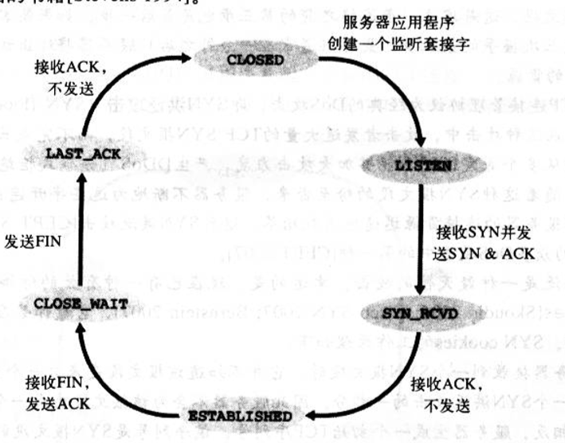

# 第三章 運輸層

3.1運輸層服務發送

應用程序 ------報文------&gt;運輸層--------分組-----&gt;網絡層

網絡路由器僅作用於數據報的網絡層字段

運輸層協議爲不同主機上的應用進程之間提供邏輯通信

網絡層:主機之間的邏輯通信

運輸層:不同主機上的進程之間提供邏輯通信

IP服務模型:盡力而爲交付服務

3.2多路複用與多路分解

多路複用:在源主機從不同套接字中收集數據塊,併爲每個數據塊封裝上首部信息,生成報文段,再將報文段傳遞到網絡層

多路分解:在接受端,運輸層檢查這些字段,表示出接受套接字.進而將報文段定向到該套接字,將運輸層報文段中的數據交付到正確的套接字的工作.

多路複用的要求:  

套接字有唯一標識符

每個報文段有特殊字符來指示該報文段所要交付的套接字

UDP套接字:二元組全面標示\(一個目的IP地址,一個目的端口號\)

TCP套接字:四元組\(源IP地址,源端口號,目的IP地址,目的端口號\)

連接請求報文段:

報文段中的源端口號

源主機的IP地址

報文段中的端口號

自身IP地址

服務器本身支持很多並行的TCP連接

3.3無連接運輸:UDP

使用UDP時,在發送報文之前,發送方與接受方的運輸層實體之間沒有握手,故稱無連接的.

適用UDP的原因:

關於發送什麼數據比何時發送的應用層控制更爲精細

無需連接建立

無連接狀態

分組首部開銷小

3.3.1報文段結構

由RFC768定義

-------------   32  比特   -------------

源端口號                    目的端口號

長度                               檢驗和

                  應用數據

                     \(報文\)

3.3.2UDP校驗和

差錯檢測

UDP在端到端的基礎上在運輸層提供差錯檢測

在系統設計中被頌的端到端原則實現

3.4可靠數據傳輸原理

rdt: 可靠數據傳輸協議

發送方與接受方有各自的FSM:有限狀態機

rdt1.0

rdt2.0 停等協議 

基於重傳機制的可靠數據傳輸協議稱爲 

自動重傳請求協議 

差錯檢測 

接受方反饋 

重傳

考慮到ACK,NAK可能受損 

rdt2.1與rdt2.2 

在數據分組中添加一個新的字段,讓發送方對其數據進行分組編號,即將發送數據分組的序號放在該字段

rdt3.0

  
檢測恢復丟包工作

重新傳輸機制:倒數定時器

發送方機制

每發送一個分組,啓動一個定時器

響應定時器中斷

終止定時器

解決流水線的差錯恢復有兩種方法

回退N步\(丟\)

選擇重新傳輸\(緩存直到丟失的傳來\)

3.5面向連接的傳輸:TCP

3.5.1 TCP連接

面向連接的

第一個特殊的TCP報文段進行響應

服務器用另一個特殊的TCP報文段進行響應

最後,客戶再用第三個特殊報文段進行響應

第一個,第二個的報文段不承載"有效載荷"

第三個可以承載

這種連接過程成爲三次握手

發送緩存

最大報文長度MSS

最大鏈路層幀長度MTU

3.5.2    TCP報文段結構

序號與確認

序號:首字節的字節流編號

確認號:主機A填充進報文段的確認號是主機A期望從主機B收到的下一字節的序號

TCP提供累計確認

3.5.3 往返時間的估計與超時

EstimatedRTT = \(1-a\)EstimatedRTT+a\*SampleRTT

RTT誤差:DEVRTT = \(1-b\)DEVRTT + b  \| Sample - EstimatedRTT \|

TimeoutInterval = EstimatedRTT +4DEVRTT

3.5.4 可靠數據傳輸

從上層應用程序接收數據,定時器超時,收到ACK.

3.5.4 流量控制

TCP通過讓發送方維護一個稱爲接收窗口的變量來提供流量控制

LastByteRead

LastByteRcvd

LastByteRcvd --- LastByteRead&lt;=RevBuffer

rwnd = RcvBuffer - \[ LastByteRcvd --- LastByteRead \]

  

 3.5.6 TCP連接管理

客戶TCP隨機選擇初始序號（client\_isn）發送 SYN報文段 SYN==1，並將其封裝進IP數據報，傳輸至服務器TCP。

服務器提取TCP SYN,爲該TCP連接分配TCP緩存與變量,並向該客戶TCP發送允許連接的報文段.首先,SYN=1,TCP首部確認號字段被置爲   clinet\_isn+1

選擇自己的初始序號 client\_isn

允許連接的報文段成爲SYNACK報文段\(SYNACK segement\)

客戶收到SYNACK後,爲該連接分配緩存與變量

將server\_isn +1 放置到TCP報文段首部的確認字段,並將SYN置爲0;

這些過程被稱爲三次握手

關閉

客戶 將FIN=1發送

服務器 收到後 發送ACK

服務器 再次發送  FIN=1的報文段

客戶收到後回覆ACK進行確認

TCP狀態圖

客戶

server

  

經由接收方的網絡反饋

直接網絡反饋

3.7 TCP擁塞控制

LastByteSent --LastByteAcked&lt;=min{cwnd,rwnd}

現在，我們假設TCP接收緩存足夠大

於是我們得到了

發送方接受速率大概是cwnd/RTT 字節/秒

通過調節cwnd的值，發送方因此能調整它向連接發送數據的速率

指導性原則

一個丟失的報文段表意味着擁塞，因此當丟失報文段時應當降低TCP發送方的速率

一個確認報文段指示該網絡正在向接受方交付發送方的報文段,因此,黨對先前爲確認報文段的確認到達時,能夠增加發送方的速率

帶寬探測

TCP擁塞控制算法

慢啓動

一開始以指數的形式增加報文段的數量

此時擁塞窗口也增加MSS的數量

閾值設置

爲cwnd的一半

擁塞避免

當cwnd的值大約是上次遇到的擁塞時的值的一半,每個RTT只將cwnd的值增加一個MSS.

結束,cwnd的值被設置成一個MSS,當丟包事件出現時,ssthresh的值被更新爲cwnd的值的一半

快速回復

對於收到的每個冗餘的ACK,cwnd的值增加一個MSS.最終,當丟失報文段的一個ACK到達時,TCP在降低cwnd後進入擁塞避免狀態.

總結 TCP擁塞控制 回顧

加性增,乘性減

TCP Vegas算法

在分組丟失發生之前,在源與目的地之間檢測路由器中的擁塞

當檢測出快要發生分組丟失時,現行降低發送速率

快要發生的分組丟失時通過觀察RTT來預測的 RTT越長,路由器的擁塞越嚴重

一條連接的平均吞吐量

第一個公式是高度理想化的

$$
\frac {0.75 * W}{RTT}
$$

$$
\frac {1.22   *  MSS } {RTT \sqrt L}
$$

完結

