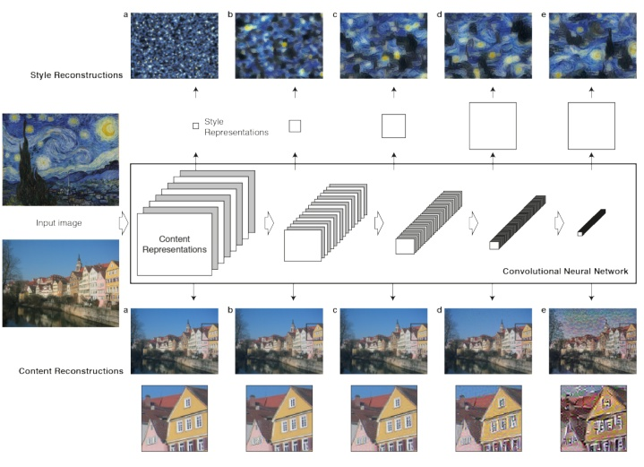

# 第三篇:（A Neural Algorithm of Artistic Style\)

  利用神經網絡進行提取 

（模電考試完，有時間更了）

（利用pretrain的Pre-trained VGG network model）來分別做Content、Style的reconstruction，在合成時考慮content loss 與style loss的最小化（其實還包括去噪變化的的loss），這樣合成出來的圖像會保證在content 和style的重構上更準確。廢話不多說看圖。

* Content Reconstruction: 上圖中下面部分是Content Reconstruction對應於CNN中的a，b，c，d，e層，注意最開始標了Content Representations的部分不是原始圖片（可以理解是給計算機比如分類器看的圖片，因此如果可視化它，可能完全就不知道是什麼內容），而是經過了Pre-trained之後的VGG network model的圖像數據， 該model主要用來做object recognition， 這裏主要用來生成圖像的Content Representations。理解了這裏，後面就比較容易了，經過五層卷積網絡來做Content的重構，文章作者實驗發現在前3層的Content Reconstruction效果比較好，d，e兩層丟失了部分細節信息，保留了比較high-level的信息。

  Style Reconstruction： Style的重構比較複雜，很難去模型化Style這個東西，Style Represention的生成也是和Content Representation的生成類似，也是由VGG network model去做的，不同點在於a,b,c,d,e的處理方式不同，Style Represention的Reconstruction是在CNN的不同的子集上來計算的，怎麼說呢，它會分別構造conv1\_1\(a\),conv 1\_1, conv2\_1,\[conv1\_1, conv2\_1, conv3\_1\],\[conv1\_1, conv2\_1, conv3\_1,conv4\_1\],\[conv1\_1, conv2\_1, conv3\_1, conv4\_1, conv5\_1\]。這樣重構的Style 會在各個不同的尺度上更加匹配圖像本身的style，忽略場景的全局信息.

