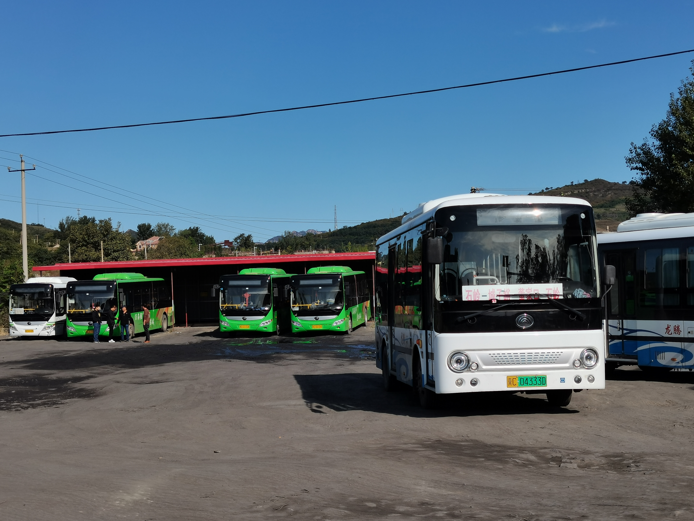

# 董家口\(遼寧河北交界\)

**野長城之行**

金秋十月,我和關子藝去了野長城,轉了兩班公交車才能到達.

中國旅遊一到旺季就是看人,但是這裏的人很少.

令人興奮和震驚的地方

**古城門**

這裏在古代是古城門,進入古城裏面有連着去長城上的路,古城裏面是村莊,供士兵休息與飲食.

**繼續向前,進入長城道,之後爬上長城.**

**長城之上**

**兩省交界\(河北~遼寧\),長城劃分.**

古城樓

到達兩省交界處

**徒步去村莊轉車**

**途中座標可能存在誤差,有一段山路未予標記.**

**結束**

